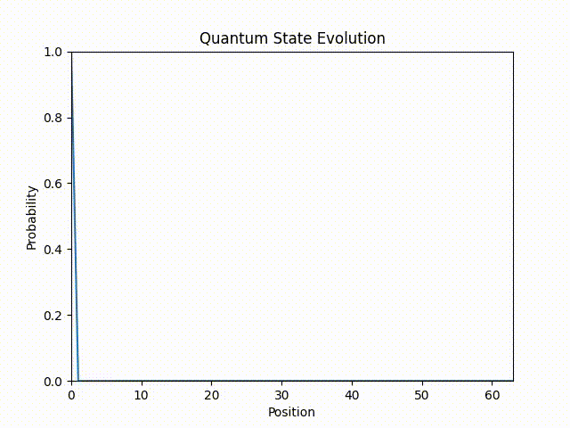
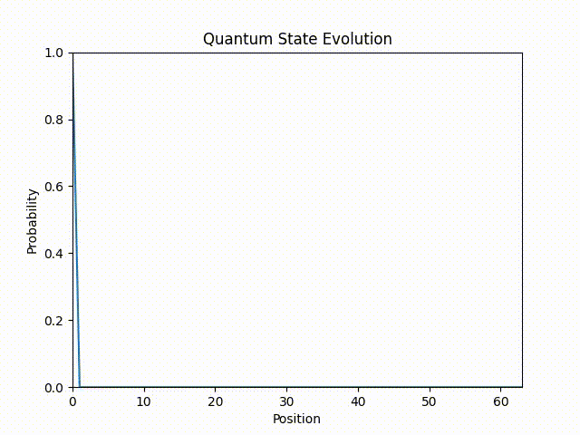

# Quantum-State-Transfer
Quantum State Transfer: Made with the UC Davis COSMOS program

## What does this do?
It solves the time dependent Schrodinger in one dimension, recording probabilities of finding the given particle (via a 64x64 Hermitian matrix) at any given point in the line.

## How does it do this?
We set up a hermitian matrix and provide it to this code in order to start it. Then, the code performs linear algebra operations each time step and puts the results for each step into the output file.

## How to use:

qst-n.c is the completed code in C. It will fill up a matrix with initial values of -13.6 representing the ground state energy of a hydrogen atom in eV. These can be changed via the linalg.c function "fmatrix_like_richard" referring to Professor Richard Scalettar, who helped teach and guide me for the project as part of the UC Davis COSMOS program.
qst-p.c is the same code. However, it uses different initial values that result in perfect quantum state transfer. You'll likely notice that the original numbers that were used for qst-c.c quickly fall into chaos due to the chaotic nature of quantum mechanics. However, fine tuning this allows us to see transfer that doesn't devolve into chaos like before.
The linalg.c and linalg.h files are the same for both folders for simplicity.

Compile and run the programs to generate your outputs.

View results in qst-out-n.txt or qst-out-p.txt for qst-n.c and qst-p.c respectively. Two python scripts for creating animations to visualize the data's continuous curve over time. It uses matplotlib and ffmpeg to produce mp4 files. The default videos are available in the repo as well, both in the respective folders and the media folder. 

Additionally, you are free to make changes to the code to try setting up your own quantum systems and seeing the chaos that they begin creating.
Some potential ideas for you:
- try finding your own perfect values
- try adding a wall/barrier in the middle and seeing how that works out, maybe you can get tunneling?
- make it two dimensional and design a way to view this two dimensional system's chaos visually

Here are the default examples:

